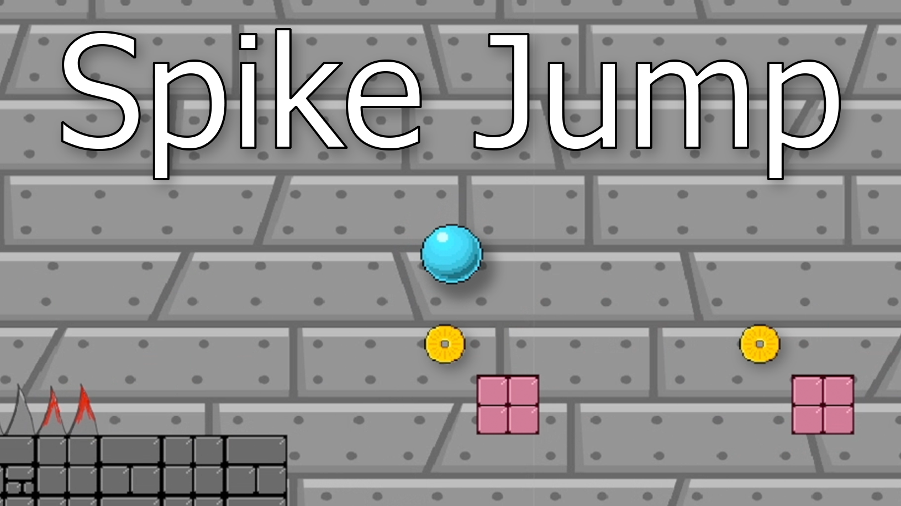
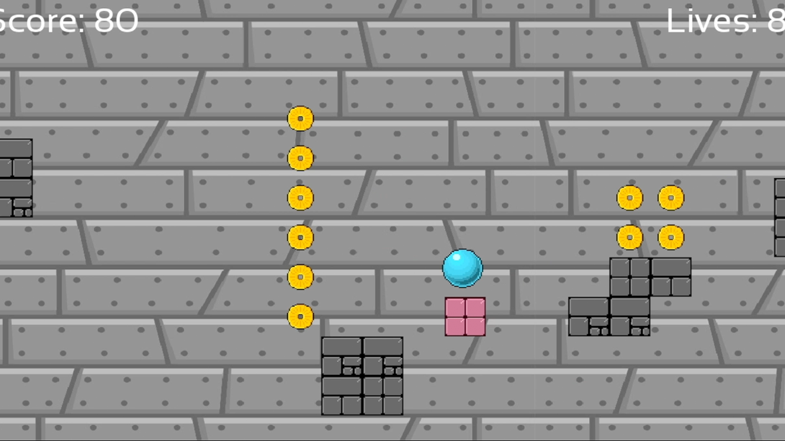

# Spike-Jump

>Cover Page

### Details

Spike jump is a simple 2D platforming game created in C++ using the SFML. It involves the player taking control of a blue ball nicknamed 'Blue'. The player must navigate through a series of levels, overcoming hazards and collecting coins on the way.

### Screenshot(s)

